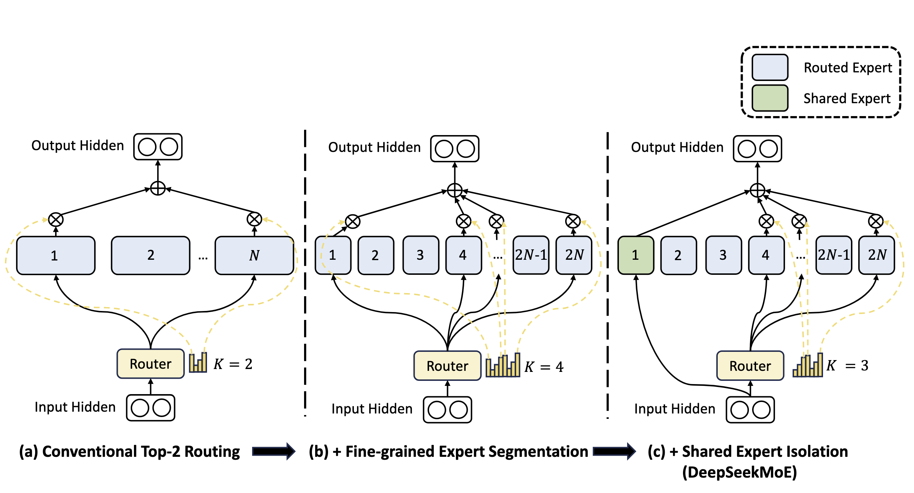

# DeepSeekMoE 简介

虽然 MoE 架构通过条件计算极大降低了计算成本，但传统的 MoE（如 GShard, Switch Transformer）面临着**专家特化不足**的问题。DeepSeek 团队提出了 **DeepSeekMoE** 架构，旨在实现极致的专家特化（Ultimate Expert Specialization）。该架构通过**细粒度专家分割**和**共享专家隔离**两大策略，解决了传统 MoE 中的“知识混合（Knowledge Hybridity）”和“知识冗余（Knowledge Redundancy）”问题。[《DeepSeekMoE: Towards Ultimate Expert Specialization in Mixture-of-Experts Language Models》](https://arxiv.org/abs/2401.06066) 提出了**DeepSeekMoE**架构，通过重构专家组织形式，实现了极致的专家特化（Expert Specialization）。

## 预备知识：Transformer 中的 MoE

DeepSeekMoE 是建立在通用 MoE 架构之上的。为了理解其改进，首先定义标准 Transformer 语言模型中的 MoE 层。假设 Transformer 的第 $l$ 层输入为 $\mathbf{u}_{1:T}^l$，其中 $\mathbf{u}_t^l$ 是第 $t$ 个 token 的隐藏状态。标准的前馈网络（FFN）计算为 $\mathbf{h}_t^l = \text{FFN}(\mathbf{u}_t^l) + \mathbf{u}_t^l$，具体来说，计算公式如下：
$$
\begin{align}
\mathbf{u}_{1:T}^{l} &= \text{Self-Att} \left( \mathbf{h}_{1:T}^{l-1} \right) + \mathbf{h}_{1:T}^{l-1}, \tag{1}\\
\mathbf{h}_{t}^{l} &= \text{FFN} \left( \mathbf{u}_{t}^{l} \right) + \mathbf{u}_{t}^{l}, \tag{2}
\end{align}
$$
而在 MoE 层中，FFN 被替换为多个专家网络。输出 $\mathbf{h}_t^l$ 的计算公式如下：
$$
\begin{align}
\mathbf{h}_t^l &= \sum_{i=1}^N g_{i,t} \text{FFN}_i(\mathbf{u}_t^l) + \mathbf{u}_t^l \tag{3} \\
g_{i,t} &= \begin{cases} 
s_{i,t}, & s_{i,t} \in \text{Topk}(\{s_{j,t} | 1 \leqslant j \leqslant N\}, K), \\
0, & \text{otherwise}, 
\end{cases} \tag{4} \\
s_{i,t} &= \text{Softmax}_i(\mathbf{u}_t^l \mathbf{e}_i^l), \tag{5}
\end{align}
$$
其中：
*   $N$ 是专家总数。
*   $K$ 是被激活的专家数量（Top-K）。
*   $\mathbf{e}_i^l$ 是第 $l$ 层第 $i$ 个专家的质心（Centroid）。
*   $g_{i,t}$ 是稀疏门控值。

---

## DeepSeekMoE 架构设计

DeepSeekMoE 在上述通用架构基础上，引入了两大核心策略来提升专家特化程度，同时保持**计算量（FLOPs）和参数量不变**。具体架构如下图所示

### 1. 细粒度专家分割 (Fine-Grained Expert Segmentation)

传统 MoE 专家数量少且参数量大，导致一个专家必须掌握多种不同的知识（知识混合）。DeepSeekMoE 将每个标准专家 FFN 切分为 $m$ 个更小的专家。

*   **参数变化**：将 FFN 的中间隐藏层维度缩小到原来的 $\frac{1}{m}$。
*   **激活变化**：为了保持计算成本不变，激活的专家数量从 $K$ 增加到 $mK$。
*   **组合灵活性**：总专家数变为 $mN$，组合空间呈指数级增长，使得知识能被更精细地分解。

引入细粒度分割后，MoE 层的输出变为：
$$
\begin{align}
\mathbf{h}_t^l &= \sum_{i=1}^{mN} g_{i,t} \text{FFN}_i(\mathbf{u}_t^l) + \mathbf{u}_t^l \tag{6} \\
g_{i,t} &= \begin{cases} 
s_{i,t}, & s_{i,t} \in \text{Topk}(\{s_{j,t} | 1 \leqslant j \leqslant mN\}, mK), \\
0, & \text{otherwise}.
\end{cases} \tag{7}\\
s_{i,t} & = \text{Softmax}(\mathbf{u}_t^{l^T}\mathbf{e}^l_i),\tag{8}
\end{align}
$$
比如 $N = 16$ 的情况下，经典的 Top-2 路由产生120种可能的组合，若每个专家被细分为4个小专家，则有4426165368种情况，大大增加了模型潜在的表达能力。

### 2. 共享专家隔离 (Shared Expert Isolation)

在传统 MoE 中，不同专家可能会重复学习通用的知识（如语法、常用词），导致**知识冗余**。DeepSeekMoE 专门隔离出 $K_s$ 个专家作为**共享专家（Shared Experts）**。

*   **共享专家**：无论输入是什么，这 $K_s$ 个专家**总是被激活**，负责捕获跨上下文的通用知识。
*   **路由专家**：剩余的专家作为路由专家（Routed Experts），负责学习特定的专业知识。
*   **计算守恒**：为了保持总计算量不变，路由专家的激活数量相应减少。

结合上述两种策略，**DeepSeekMoE 的最终数学表达**如下：

$$
\begin{align}
\mathbf{h}_t^l &= \underbrace{\sum_{i=1}^{K_s} \text{FFN}_i(\mathbf{u}_t^l)}_{\text{Shared Experts}} + \underbrace{\sum_{i=K_s+1}^{mN} g_{i,t} \text{FFN}_i(\mathbf{u}_t^l)}_{\text{Routed Experts}} + \mathbf{u}_t^l \tag{9} \\
g_{i,t} &= \begin{cases} 
s_{i,t}, & s_{i,t} \in \text{Topk}(\{s_{j,t} | K_s + 1 \leqslant j \leqslant mN\}, mK - K_s), \\
0, & \text{otherwise}, 
\end{cases} \tag{10} \\
s_{i,t} &= \text{Softmax}_i(\mathbf{u}_t^l \mathbf{e}_i^l). \tag{11}
\end{align}
$$

*   **总专家数**：$mN$。
*   **共享专家数**：$K_s$（固定激活，不经过 Top-K 选择）。
*   **路由专家数**：$mN - K_s$。
*   **路由激活数**：$mK - K_s$（通过 Top-K 选择）。

---

## 负载均衡与训练策略

为了解决 MoE 训练中的**路由崩塌**（Routing Collapse）和分布式训练中的**计算瓶颈**，DeepSeekMoE 引入了两个层级的辅助损失函数。

### 1. 专家级负载均衡 (Expert-Level Balance Loss)
用于防止模型只选择少数几个专家，导致其他专家训练不足。
$$
\begin{align}
\mathcal{L}_{\text{ExpBal}} &= \alpha_1 \sum_{i=1}^{N'} f_i P_i, \tag{12} \\
f_i &= \frac{N'}{K'T} \sum_{t=1}^T \mathbb{1}(\text{Token } t \text{ selects Expert } i), \tag{13} \\
P_i &= \frac{1}{T} \sum_{t=1}^T s_{i,t}, \tag{14}
\end{align}
$$
其中 $N'$ 是路由专家总数，$K'$ 是路由激活数，$\alpha_1$ 是超参数（通常设置较小，如 0.001~0.01），$\mathbb{1}(\cdot)$ 是指示函数。

### 2. 设备级负载均衡 (Device-Level Balance Loss)
为了解决大规模分布式训练中的计算不均问题。假设所有路由专家被划分为 $D$ 个组（部署在 $D$ 个设备上，$\mathcal{E}_1, \dots, \mathcal{E}_D$），我们不强制每个专家完全平衡，但强制**每个设备**上的总计算负载平衡。
$$
\begin{align}
\mathcal{L}_{\text{DevBal}} &= \alpha_2 \sum_{i=1}^{D} f'_i P'_i, \tag{15} \\
f'_i &= \frac{1}{|\mathcal{E}_i|} \sum_{j \in \mathcal{E}_i} f_j, \tag{16} \\
P'_i &= \sum_{j \in \mathcal{E}_i} P_j, \tag{17}
\end{align}
$$
其中 $\alpha_2$ 是设备级平衡因子。实践中，$\alpha_2$ 设置得比 $\alpha_1$ 大（如 0.05），以确保硬件效率。

---

## 实验细节与模型配置

论文通过不同规模的模型验证了架构的有效性，主要对比基线是 **GShard**（Top-2 Routing）和同等规模的 **Dense** 模型。

### 关键超参数配置
在 DeepSeekMoE 的实验中，通常遵循以下配置比例（参考 Appendix A）：
*   **相对专家大小 (Relative Expert Size)**：$0.25$（即 $m=4$，每个专家是标准 FFN 的 1/4 大小）。
*   **共享专家比例**：通常配置 **1 或 2 个** 共享专家。
*   **路由配置**：
    *   **2B 模型**：总参数 2.0B，激活参数 0.3B。使用 1 个共享专家，63 个路由专家（激活 7 个）。
    *   **16B 模型**：总参数 16.4B，激活参数 2.8B。使用 2 个共享专家，64 个路由专家（激活 6 个）。
    *   **145B 模型**：总参数 144.6B，激活参数 22.2B。使用 4 个共享专家，128 个路由专家（激活 12 个）。

### 性能结论
1.  **Iso-FLOPs 优势**：在同等计算量下，DeepSeekMoE 显著优于 GShard 架构。
2.  **逼近上限**：DeepSeekMoE 2B 的性能非常接近具有相同总参数量的 Dense 模型（这被认为是 MoE 的性能上限）。
3.  **极致特化**：实验表明，如果移除共享专家或禁用部分路由专家，DeepSeekMoE 的性能下降比 GShard 更剧烈，说明其每个专家都学到了不可替代的特定知识（冗余度低）。