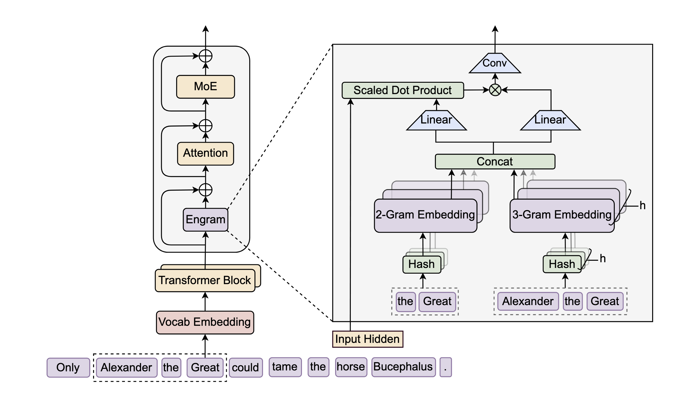

# Engram: LLM 的新稀疏轴——条件记忆

本篇笔记参考的是 DeepSeek 的最新论文 [《Conditional Memory via Scalable Lookup: A New Axis of Sparsity for Large Language Models》](https://arxiv.org/abs/2601.07372)。这篇论文在 MoE 模型（条件计算）的基础之上，提出了**条件记忆**（Conditional Memory）的概念，并设计了全新的网络架构 **Engram**。

**核心突破：** 传统的 MoE 解决了“计算瓶颈”，Engram 解决了“存储瓶颈”。它利用 N-gram 的确定性，实现了在推理过程中将海量的静态参数（Embedding Table）卸载到 CPU 内存甚至 SSD 中，并通过预取（Prefetching）掩盖通信延迟，是 LLM 走向超大规模稀疏化的一个里程碑。

## 核心理念：双轴稀疏性 (Two Axes of Sparsity)

DeepSeek 认为语言建模包含两类截然不同的任务，现有的 Transformer 强行用同一套参数处理它们是低效的：
1.  **组合推理 (Compositional Reasoning)**：需要深度的逻辑处理。**解决方案：MoE（条件计算）**，动态激活专家网络。
2.  **知识检索 (Knowledge Retrieval)**：如“巴黎是法国的首都”，是静态的、死记硬背的。**解决方案：Engram（条件记忆）**，静态查表。

Engram 的目标就是把“死记硬背”的任务从昂贵的神经网络计算中剥离出来，用极其廉价的 $O(1)$ 查表来实现。

---

## Engram 架构详解

Engram 模块作为一个**即插即用**的组件，通常插入在 Transformer 的前几层（论文中推荐 Layer 2），用于替模型“分担”早期的词组识别和事实检索压力。具体架构如下所示：

其工作流包含五个关键步骤：

### 1. 词表压缩 (Tokenizer Compression)
传统的 Tokenizer（如 BPE）为了无损重建，往往把一个常用词组映射为多个不同 ID（例如 ` Apple` vs `_Apple`）。为了让 N-gram 查找更精准，Engram 首先做一个满映射 $\mathcal{P}:V \to V'$，将语义等价的 token 归一化（比如大小写、前导空格等）。
$$
x'_t = \mathcal{P}(x_t)
$$
这一步能将有效词表大小压缩约 23%，提高语义密度。形式上，对于位置 $t$ 处的标记，我们将其原始 ID $x_t$ 映射到规范 ID $x_t' = \mathcal{P}(x_t)$ 以形成后缀 N-gram $g_{t,n} = (x_{t−n+1}', ..., x_t' )$。

### 2. 多头哈希检索 (Multi-Head Hashing)
这是 Engram 的核心。为了避免存储所有可能的 N-gram（组合爆炸），论文采用了哈希映射。给定当前位置 $t$ 的上下文（即历史 tokens），构造后缀 N-gram $g_{t,n}$。

使用 $K$ 个不同的哈希函数（Hash Heads）将上下文映射到 Embedding 表 $\mathbf{E}$ 的索引上：
$$
\begin{align}
z_{t,n,k} &\triangleq \varphi_{n,k}(g_{t,n}), \\
\mathbf{e}_{t,n,k} &= \mathbf{E}_{n,k}[z_{t,n,k}] \tag{1}
\end{align}
$$
最终检索到的静态记忆向量 $\mathbf{e}_t$ 是所有 $N$ 阶、$K$ 个头的 Embedding 的拼接：
$$
\mathbf{e}_t \triangleq \mathop{\Big\Vert}_{n=2}^N \mathop{\Big\Vert}_{k=1}^K \mathbf{e}_{t,n,k} \tag{2}
$$
*   **拓展理解**：这里用多个哈希头是为了解决**哈希冲突**。就像 Bloom Filter 一样，虽然一个哈希函数可能会把“苹果”和“香蕉”撞到一起，但 $K$ 个哈希函数同时撞车的概率极低。

### 3. 上下文感知门控 (Context-Aware Gating)
查表得到的向量 $\mathbf{e}_t$ 是静态的（Static），可能包含噪音（哈希冲突）或歧义。模型需要根据当前的隐藏状态 $\mathbf{h}_t$（代表当前语境）来决定“信不信”这个检索结果。

这实际上是一个 Cross-Attention 变体：
*   **Query**: 当前隐藏状态 $\mathbf{h}_t$
*   **Key/Value**: 检索到的记忆 $\mathbf{e}_t$

$$
\begin{align}
\mathbf{k}_t &= \mathbf{W}_K \mathbf{e}_t, \quad \mathbf{v}_t = \mathbf{W}_V \mathbf{e}_t \tag{3} \\
\alpha_t &= \sigma \left( \frac{\text{RMSNorm}(\mathbf{h}_t)^\top \text{RMSNorm}(\mathbf{k}_t)}{\sqrt{d}} \right) \tag{4}
\end{align}
$$
其中 $\sigma$ 是 Sigmoid 函数，$\alpha_t \in (0,1)$ 是门控系数。如果检索结果 $\mathbf{e}_t$ 与当前语境 $\mathbf{h}_t$ 不相关，$\alpha_t$ 就会趋近于 0，从而抑制噪音。

### 4. 融合与输出 (Fusion)
最终，经过门控的记忆向量 $\tilde{\mathbf{v}}_t = \alpha_t \cdot \mathbf{v}_t$ 还会经过一个轻量级的**深度卷积**（Depthwise Conv）来增强局部非线性，然后加回到残差流中：
$$
\mathbf{Y} = \text{SiLU}(\text{Conv1D}(\text{RMSNorm}(\tilde{\mathbf{v}}_t))) + \tilde{\mathbf{v}}_t \tag{5}
$$
$$
\mathbf{H}^{(\ell)} \leftarrow \mathbf{H}^{(\ell)} + \mathbf{Y}
$$
**激活函数SiLU (Sigmoid Linear Unit)**
公式中使用的激活函数是 $\text{SiLU}(x) = x \cdot \sigma(x)$。其中 
$$
\sigma(x) = \frac{1}{1 + e^{-x}}
$$
相比于 ReLU，SiLU 是光滑非单调的，并且允许少量负值通过。在深层网络中（尤其是像 DeepSeek 这种大模型），SiLU 通常比 ReLU 有更好的梯度流和收敛性能，且自带一种隐式的“门控”特性（当 $x$ 很负时输出接近 0）。

**局部时间域卷积 (Local Temporal Convolution)**：
设经过 $\text{RMSNorm}$ 后的张量为 $\mathbf{X} \in \mathbb{R}^{T \times d}$（其中 $T$ 为序列长度，$d$ 为模型维度）。卷积操作通常采用**深度卷积**，其核函数 $\mathbf{W} \in \mathbb{R}^{k \times 1}$（$k$ 为窗口大小，如 3 或 5）独立作用于每个通道。对于位置 $t$ 的第 $j$ 个维度，其计算过程为：
$$\text{Conv1D}(\mathbf{X})_{t,j} = \sum_{i=0}^{k-1} \mathbf{W}_i \cdot \mathbf{X}_{t-\lfloor k/2 \rfloor + i, \ j}$$
这种操作通过对时间轴上的 $k$ 个相邻 Token 进行加权求和，实现了**局部上下文的平滑**，有效缓解了 N-gram 检索带来的序列不连续问题。

### 5. 与多分支架构的集成 (Integration with Multi-branch Architecture)
**（这是论文 2.4 节的重点细节）**
现代 LLM（如 DeepSeek-V3）通常采用多分支架构（Multi-branch），即残差流被扩展到 $M$ 个并行分支中。如果简单地对每个分支都做一遍 Engram 计算，参数量和计算量会暴增。

论文提出了一种**参数共享策略**：
*   **共享部分**：Embedding 表 $\mathbf{E}$ 和 Value 投影矩阵 $\mathbf{W}_V$ 在所有 $M$ 个分支间共享（节省显存）。
*   **独立部分**：Key 投影矩阵 $\{\mathbf{W}_K^{(m)}\}_{m=1}^M$ 是每个分支独立的（保证不同分支能关注不同的记忆）。

对于第 $m$ 个分支，其门控信号 $\alpha_t^{(m)}$ 计算如下：
$$
\alpha_t^{(m)} = \sigma \left( \frac{\text{RMSNorm}(\mathbf{h}_t^{(m)})^\top \text{RMSNorm}(\mathbf{W}_K^{(m)} \mathbf{e}_t)}{\sqrt{d}} \right) \tag{6}
$$
最终该分支的输出是 $\mathbf{u}_t^{(m)} = \alpha_t^{(m)} \cdot (\mathbf{W}_V \mathbf{e}_t)$。
这种设计允许将所有分支的线性投影融合为一个大的密集 FP8 矩阵乘法，极大地提升了 GPU 利用率。

---

## 稀疏分配定律 (The U-Shaped Scaling Law)

论文发现了一个 **U 型曲线**：
*   **纯 MoE (100% 专家)**：不是最优的，因为专家要浪费参数去背书。
*   **纯 Engram (0% 专家)**：表现很差，因为缺乏推理能力。
*   **最优解 (Sweet Spot)**：大约 **20%~25%** 的稀疏参数分配给 Engram，剩下的给 MoE。

这一发现证明了 Engram 不是 MoE 的替代品，而是**最佳互补品**。参考如下的实验结果图：

左：分配比率 $\rho$ 的验证损失。显示了两个计算预算（2e20 和 6e20 FLOP）。两种制度都呈现出 U 形，混合分配超过了纯 MoE。右图：无限内存状态下的缩放行为。验证损失相对于嵌入数量呈现对数线性趋势。

---

## 深度分析：计算与存储的彻底分离

这是 Engram 区别于 MoE 最本质的系统创新，也是“新稀疏方向”的核心所在。

### 1. MoE 的“预取困境”
在标准的 MoE 模型中，路由（Routing）是**状态依**（State-Dependent）的。
*   第 $L$ 层的专家选择，依赖于第 $L-1$ 层计算出来的 Hidden State。
*   这意味着：在 $L-1$ 层算完之前，我们根本不知道 $L$ 层需要加载哪个专家。
*   **后果**：由于 PCIe 带宽远慢于 GPU 计算，如果专家不在显存里，GPU 就必须停下来等内存加载，导致严重的推理延迟。这也是为什么现在的 MoE 模型（如 Mixtral）必须把所有专家都塞进显存的原因。
 
### 2. Engram 的“零开销预取” (Zero-Overhead Prefetching)
Engram 的检索是**Token 依赖**（Token-Dependent）的。
*   N-gram 哈希索引 **只取决于输入的 Token 序列**。
*   这意味着：**一旦用户输入了 Prompt，模型甚至还没开始跑 Layer 0，我们就已经知道 Layer 2、Layer 15 需要查哪些 Embedding 表的索引了！**

### 3. 流水线设计 (Pipeline Strategy)
基于上述特性，DeepSeek 设计了完美的计算-存储流水线：
*   **计算流 (GPU)**：GPU 正在全力计算 Layer $0 \to 1$ 的稠密层/MoE层。
*   **存储流 (CPU/PCIe)**：CPU 利用这段时间，异步地将 Layer 2 所需的 Engram Embedding 从 Host Memory（甚至 SSD）预取并通过 PCIe 搬运到 GPU 的小块显存缓存中。
*   **结果**：当 GPU 算到 Layer 2 时，数据已经在那等着了。**通信延迟被计算时间完全掩盖（Overlap）。**

### 4. 存储层级化 (Memory Hierarchy)
结合 Zipfian 定律（语言中 20% 的词组占据 80% 的出现频率），Engram 实现了三级存储：
1.  **HBM (显存)**：缓存最热的 N-gram（如 "New York", "Deep Learning"）。
2.  **DRAM (内存)**：存放中频 N-gram。
3.  **SSD (硬盘)**：存放几百 TB 的长尾 N-gram（极生僻的知识）。

**结论：** Engram 使得模型的“记忆容量”不再受限于昂贵的 GPU 显存，理论上可以无限扩展，而推理成本（Latency）几乎不增加。

---

## 总结：MoE 与 Engram 的对比

| 特性 | MoE (DeepSeekMoE) | Engram (本论文) |
| :--- | :--- | :--- |
| **稀疏轴** | **条件计算** (Conditional Computation) | **条件记忆** (Conditional Memory) |
| **功能定位** | 逻辑推理、复杂泛化 | 知识检索、固定搭配、事实查表 |
| **寻址依赖** | **动态依赖 (Runtime State)** 必须算完上一层才知道下一层 | **静态依赖 (Input Token)** 输入确定后，全网索引即确定 |
| **存储分离** | **难** (无法预取，必须驻留显存) | **易** (可完美预取，存放在CPU/SSD) |
| **计算复杂度** | $O(N)$ (矩阵乘法) | $O(1)$ (查表) |

**一句话总结**：Engram 实际上是把大模型中“死记硬背”的那部分脑细胞（参数）抠了出来，做成了一本巨大的字典（Hash Table），扔在书包里（CPU 内存）；由于字典查哪个字完全取决于课文内容（Input Token），我们可以在大脑（GPU）思考上一段话逻辑的同时，手（CPU）已经把下一段话要查的生词提前翻好递过来了。