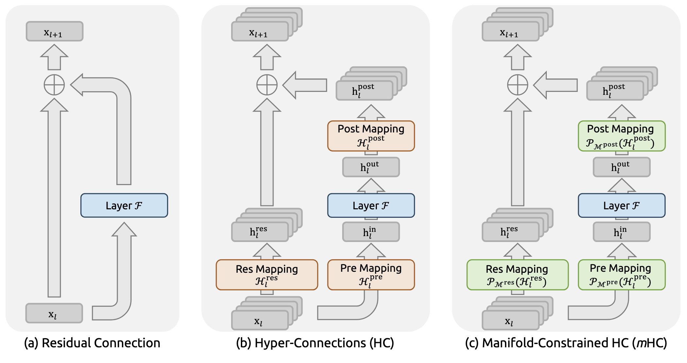

# mHC: 流形约束下的超连接

本篇笔记参考的是 DeepSeek 的最新论文 **mHC**—— [《mHC: Manifold-Constrained Hyper-Connections》](https://arxiv.org/abs/2512.24880)。它不仅是对网络拓扑结构（Macro-design）的改进，更是一次**数学理论指导架构设计**的典范。mHC 通过引入流形约束，在保持 Hyper-Connections 高容量特性的同时，恢复了深层网络训练所必需的数值稳定性。但是流形投射的这个思想在很早的就已经出现了，见lubich2007年的DLRA文章，动态低秩逼近的开山鼻祖。数学的很多思想应用到大模型架构上面，也许能做出很大的改善。

**核心背景**：Hyper-Connections (HC) 通过将残差流宽度扩展 $n$ 倍提升了模型性能，但破坏了 ResNet 赖以生存的“恒等映射”性质，导致深层网络训练极不稳定（梯度爆炸）。**mHC** 提出将残差连接矩阵投影到**Birkhoff 多面体**（双随机矩阵流形）上，从数学原理上强制恢复了信号传播的守恒性。

---

# mHC: 流形约束下的超连接 (Manifold-Constrained Hyper-Connections)

**核心背景**：DeepSeek 之前的研究提出了 Hyper-Connections (HC)，通过将残差流宽度扩展 $n$ 倍来提升模型性能。然而，HC 破坏了 ResNet 赖以生存的“恒等映射”性质，导致深层网络信号爆炸，训练极不稳定。**mHC** 提出了一种基于流形理论的解决方案，将参数矩阵投影到**Birkhoff 多面体**（双随机矩阵流形）上，从数学原理上强制恢复了信号传播的守恒性，并辅以系统级优化解决显存墙问题。

---

## 1. 预备知识：从 ResNet 到 HC 的数值危机

要理解 mHC，首先要看清 HC 是如何破坏经典 ResNet 的稳定性的。

### 1.1 经典残差连接 (ResNet)

深度学习的基石是残差连接，其核心在于**恒等映射 (Identity Mapping)**。 单层前向传播公式：

$$\mathbf{x}_{l+1} = \mathbf{x}_l + \mathcal{F}(\mathbf{x}_l, \mathcal{W}_l),\tag{1}$$

递归展开多层后得到：

$$\mathbf{x}_L = \mathbf{x}_l + \sum_{i=l}^{L-1} \mathcal{F}(\mathbf{x}_i, \mathcal{W}_i),\tag{2}$$

- **物理意义**：$\mathbf{x}_l$ 的信号可以直接无损地流向 $\mathbf{x}_L$。这种“加法”结构保证了梯度在反向传播时不会消失或爆炸，这是训练深层网络的前提。
    

### 1.2 Hyper-Connections (HC) 的引入

HC 将输入特征 $\mathbf{x}_l$ 的维度从 $C$ 扩展为 $n \times C$（即 $n$ 个并行的残差流），以此增加拓扑复杂度。 HC 的单层传播公式 **Eq. (3)**：

$$\mathbf{x}_{l+1} = \mathcal{H}_l^{\text{res}}\mathbf{x}_l + {\mathcal{H}_l^{\text{post}}}^\top \mathcal{F}(\mathcal{H}_l^{\text{pre}}\mathbf{x}_l, \mathcal{W}_l),\tag{3}$$

这里引入了三个线性映射矩阵：

- $\mathcal{H}^{\text{pre}}$：将宽流聚合为层输入。
    
- $\mathcal{H}^{\text{post}}$：将层输出广播回宽流。
    
- **$\mathcal{H}_l^{\text{res}} \in \mathbb{R}^{n \times n}$**：**关键项**，负责在 $n$ 个残差流之间进行特征混合。
    

### 1.3 HC 的数学危机：信号爆炸

当我们将 HC 扩展到多层时，问题出现了。递归展开 Eq. (3) 得到 **Eq. (4)**：

$$\mathbf{x}_L = \left( \prod_{i=l}^{L-1} \mathcal{H}_{L-i}^{\text{res}} \right) \mathbf{x}_l + \sum_{i=l}^{L-1} \left( \prod_{j=1}^{L-1-i} \mathcal{H}_{L-j}^{\text{res}} \right) {\mathcal{H}_i^{\text{post}}}^\top \mathcal{F}(\mathcal{H}_i^{\text{pre}}\mathbf{x}_i, \mathcal{W}_i)\tag{4}$$

- **数学解释**：请注意第一项中的连乘积 $\prod \mathcal{H}^{\text{res}}$。在原始 HC 中，$\mathcal{H}^{\text{res}}$ 是无约束的可学习矩阵。
    
    - 如果 $\mathcal{H}^{\text{res}}$ 的奇异值略大于 1，经过几十层的连乘，信号幅值会呈指数级爆炸（Exploding）。
        
    - 论文实验显示，在 HC 中这个增益幅度（Amax Gain）甚至达到了 **3000**，彻底破坏了训练稳定性。
        

---

## 2. mHC 方法论：流形约束 (Manifold Constraint)

mHC 的核心思想是：**不直接优化欧几里得空间中的参数，而是将其限制在一个特定的几何流形上，使其具备“保范性”**。

### 2.1 定义流形：Birkhoff 多面体

论文提出将 $\mathcal{H}^{\text{res}}$ 限制为**双随机矩阵 (Doubly Stochastic Matrix)**。 双随机矩阵流形 $\mathcal{M}^{\text{res}}$ 的定义如：

$$\mathcal{P}_{\mathcal{M}^{\text{res}}}(\mathcal{H}^{\text{res}}) := \left\{ \mathcal{H}^{\text{res}} \in \mathbb{R}^{n \times n} \mid \mathcal{H}^{\text{res}}\mathbf{1}_n = \mathbf{1}_n, \mathbf{1}_n^\top\mathcal{H}^{\text{res}} = \mathbf{1}_n^\top, \mathcal{H}^{\text{res}} \geqslant 0 \right\}\tag{6}$$

- **约束条件**：
    
    1. $\mathcal{H}^{\text{res}}\mathbf{1}_n = \mathbf{1}_n$：每一行的和为 1。
        
    2. $\mathbf{1}_n^\top\mathcal{H}^{\text{res}} = \mathbf{1}_n^\top$：每一列的和为 1。
        
    3. $\mathcal{H}^{\text{res}} \geqslant 0$：所有元素非负。
        
- **物理意义与数学性质**：
    
    1. **凸组合**：$\mathcal{H}^{\text{res}}\mathbf{x}_l$ 实际上是对输入特征进行了加权平均（凸组合），这意味着信号的均值和能量被“守恒”了。
        
    2. **范数有界**：双随机矩阵的谱范数 $\le 1$，保证了映射是**非扩张 (Non-expansive)** 的，从根本上杜绝了梯度爆炸。
        
    3. **组合封闭性**：数学上，两个双随机矩阵的乘积依然是双随机矩阵。这意味着 **Eq. (4)** 中的连乘项 $\prod \mathcal{H}^{\text{res}}$ 无论多深，始终保持稳定，恢复了类似 ResNet 的恒等映射性质。
        

### 2.2 参数化与投影实现

mHC 的实现分为两步：先计算无约束的“动态映射”，再通过算法投影到流形上。

**Step 1: 线性投影生成原始参数** 首先将 $l$ 层的输入隐藏矩阵 $\mathbf{x}_l\in \mathbb{R}^{n\times C}$ 展开为向量形式 $\vec{\mathbf{x}}_l = \text{vec}(\mathbf{x}_l)\in \mathbb{R}^{1\times nC}$ 保全了所有的信息。然后利用HC的公式做计算如下： $$\begin{cases} \vec{\mathbf{x}}_l' = \text{RMSNorm}(\vec{\mathbf{x}}_l) \\ \tilde{\mathcal{H}}_l^{\text{pre}} = \alpha_l^{\text{pre}} \cdot (\vec{\mathbf{x}}_l' \varphi_l^{\text{pre}}) + \mathbf{b}_l^{\text{pre}} \\ \tilde{\mathcal{H}}_l^{\text{post}} = \alpha_l^{\text{post}} \cdot (\vec{\mathbf{x}}_l' \varphi_l^{\text{post}}) + \mathbf{b}_l^{\text{post}} \\ \tilde{\mathcal{H}}_l^{\text{res}} = \alpha_l^{\text{res}} \cdot \text{mat}(\vec{\mathbf{x}}_l' \varphi_l^{\text{res}}) + \mathbf{b}_l^{\text{res}} \end{cases}\tag{7}$$ 其中 $\varphi_l^{\text{pre}},\varphi_l^{\text{post}}\in \mathbb{R}^{nC\times n}$ 和 $\varphi_l^{\text{res}}\in \mathbb{R}^{nC\times n^2}$ 是线性投影，计算得到的是未归一化的中间矩阵 $\tilde{\mathcal{H}}$。这里 $\text{mat}(\cdot)$ 是 $\mathbb{R}^{1\times n^2}$ 到 $\mathbb{R}^{n\times n}$ 的重构函数。

**Step 2: 流形投影与激活** 最终的限制投影映射为 $$\begin{cases} \mathcal{H}_l^{\text{pre}} = \sigma(\tilde{\mathcal{H}}_l^{\text{pre}}) \\ \mathcal{H}_l^{\text{post}} = 2\sigma(\tilde{\mathcal{H}}_l^{\text{post}}) \\ \mathcal{H}_l^{\text{res}} = \text{Sinkhorn-Knopp}(\tilde{\mathcal{H}}_l^{\text{res}}), \end{cases}\tag{8}$$

- **Pre/Post 映射**：使用 Sigmoid 激活函数 $\sigma(\cdot)$ 保证非负性，防止正负抵消导致的信号消失。
    
- **Res 映射**：使用 **Sinkhorn-Knopp** 算法进行流形投影，为了保证残差的恒等性质，参考 ResNet的构造方法。
    

**Step 3: Sinkhorn-Knopp 迭代算法** 这是一个将任意正矩阵转换为双随机矩阵的经典算法。给定初始正矩阵 $\mathbf{M}^{(0)} = \exp(\tilde{\mathcal{H}}^{\text{res}})$，迭代如下：

$$\mathbf{M}^{(t)} = \mathcal{T}_r \left( \mathcal{T}_c (\mathbf{M}^{(t-1)}) \right),\tag{9}$$

- $\mathcal{T}_c$：列归一化（每列除以该列之和）。
    
- $\mathcal{T}_r$：行归一化（每行除以该行之和）。
    
- **收敛性**：论文指出，交替进行行/列归一化，当 $t \to \infty$ 时矩阵收敛于双随机矩阵 $\mathcal{H}_l^{\text{res}} = \mathbf{M}^{(t_{\text{max}})}$ 当 $t_{\text{max}}\to \infty$。实验中使用 $t_{\text{max}}=20$ 即可满足精度要求。
    

---

## 3. 基础设施优化：计算与存储分离

mHC 引入了 $n \times C$ 的宽残差流（例如 $n=4$），这带来了巨大的显存访问压力（Memory Wall）。DeepSeek 设计了专门的系统优化方案。

### 3.1 内核融合 (Kernel Fusion)

为了最大化带宽利用率，论文将多个操作融合为单一 Kernel。比如偏置和线性投影被整合入 $\mathbf{b}_l$ 和 $\varphi_l$，RMSNorm的权重也被整合入 $\varphi_l$。以下是 Kernel 的具体输入定义： $$\begin{align} \varphi_l &: \text{tfloat32 } [nC, n^2 + 2n] \tag{10} \\ \vec{\mathbf{x}}_l &: \text{bfloat16 } [1, nC] \tag{11} \\ \alpha_l^{\text{pre}}, \alpha_l^{\text{post}}, \alpha_l^{\text{res}} &: \text{float32 Scalars} \tag{12} \\ \mathbf{b}_l &: \text{float32 } [1, n^2 + 2n] \tag{13} \end{align}$$

**融合计算流程 Eq. (14)-(19)**： 首先通过一次矩阵乘法计算所有中间态：

$$[\tilde{\mathcal{H}}_l^{\text{pre}}, \tilde{\mathcal{H}}_l^{\text{post}}, \tilde{\mathcal{H}}_l^{\text{res}}] = \vec{\mathbf{x}}_l \varphi_l \tag{14}$$

计算 RMSNorm 的归一化因子：

$$r = \|\vec{\mathbf{x}}_l\|_2 / \sqrt{nC} \tag{15}$$

应用缩放因子和偏置（注意这里融合了归一化操作）：

$$[\tilde{\mathcal{H}}^{\text{pre}}, \tilde{\mathcal{H}}^{\text{post}}, \tilde{\mathcal{H}}^{\text{res}}] = 1/r \cdot \left[\alpha_l^{\text{pre}}\tilde{\tilde{\mathcal{H}}}_l^{\text{pre}},\alpha_l^{\text{post}}\tilde{\tilde{\mathcal{H}}}_l^{\text{post}},\alpha_l^{\text{res}}\tilde{\tilde{\mathcal{H}}}_l^{\text{res}},\right] + \mathbf{b}_l \tag{16}$$

最后，在 **SRAM (片上缓存)** 中直接完成激活和迭代，无需写回显存： $$\begin{align} \mathcal{H}_l^{\text{pre}} &= \sigma(\tilde{\mathcal{H}}_l^{\text{pre}}) \tag{17} \\ \mathcal{H}_l^{\text{post}} &= 2\sigma(\tilde{\mathcal{H}}_l^{\text{post}}) \tag{18} \\ \mathcal{H}_l^{\text{res}} &= \text{Sinkhorn-Knopp}(\tilde{\mathcal{H}}_l^{\text{res}}) \tag{19} \end{align}$$

### 3.2 动态重计算 (Recomputing)

由于残差流变宽了 $n$ 倍，存储所有层的中间激活值会导致显存爆炸。

- **策略**：前向传播后丢弃 mHC 的中间结果，仅保留每 $L_r$ 层的输入 $\mathbf{x}_{l_0}$，反向传播时重算。
    
- **最优分块大小推导 Eq. (20)**：寻找最优的 Checkpoint 间隔 $L_r^*$，以最小化总显存占用：    $$ L_r^* = \arg \min_{L_r} \left[ nC \times \left\lceil\frac{L}{L_r}\right\rceil + (n+2)C \times L_r \right] \approx \sqrt{\frac{nL}{n+2}}\tag{20}$$
    
    - 第一项：存储 Checkpoint 的常驻显存开销。
        
    - 第二项：重计算时的临时显存开销。
        

### 3.3 DualPipe 中的通信重叠

针对大规模流水线并行（Pipeline Parallelism），mHC 扩展了 DualPipe 调度。

- 将 MLP 层（计算密集）的残差计算放在高优先级流。
    
- 将 Attention 层（访存密集）作为背景流。
    
- **效果**：利用 Attention 的计算时间窗口，掩盖 mHC 宽残差流带来的额外通信延迟，实现了计算与通信的完美重叠。
    

mHC中的通信计算重叠的图如下所示

---

## 4. 实验与分析

### 4.1 稳定性分析

- **梯度范数 (Fig. 5)**：HC 的梯度范数剧烈震荡，而 mHC 曲线平滑，接近 Baseline。
    
- **信号增益 (Amax Gain Magnitude)**：
    
    - HC (Fig. 3)：信号增益最高达 **3000**（爆炸）。
        
    - mHC (Fig. 7)：信号增益被严格限制在 **1.6** 以内（守恒）。这验证了流形约束的理论有效性。
        

### 4.2 性能结果 (Table 4)

在 27B 参数规模下，mHC 全面超越 Baseline 和 HC，特别是在逻辑推理任务上：

- **BBH**: Baseline 43.8 $\to$ HC 48.9 $\to$ **mHC 51.0** (+2.1%)
    
- **DROP**: Baseline 47.0 $\to$ HC 51.6 $\to$ **mHC 53.9** (+2.3%)
    
- **训练开销**：在扩展率 $n=4$ 时，训练时间仅增加 **6.7%**，这得益于上述的系统级优化。
    

---

**总结**：mHC 是一项完美的“理论指导实践”的工作。它通过引入 **Birkhoff 多面体** 和 **Sinkhorn-Knopp 算法**，在数学上修复了 HC 架构的数值缺陷；同时通过 **Kernel Fusion** 和 **Recomputing** 等工程手段，解决了宽残差流带来的系统瓶颈，是未来大模型架构设计（Macro Design）的重要参考。