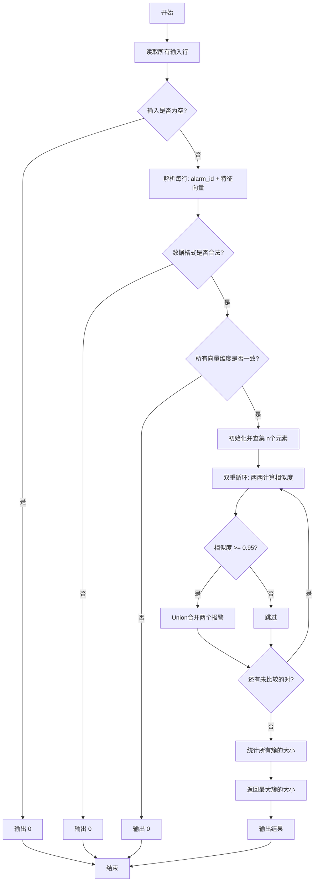

# 聚类警告算法详解

## 📋 目录
- [问题描述](#问题描述)
- [算法概述](#算法概述)
- [核心组件](#核心组件)
- [算法流程](#算法流程)
- [数学原理](#数学原理)
- [示例演示](#示例演示)
- [时间复杂度分析](#时间复杂度分析)

---

## 问题描述

### 输入
从标准输入读取多行报警记录，每行格式为：
```
alarm_id feature1 feature2 ... featureD
```

**示例输入：**
```
A1 0.1 0.2 0.3
A2 0.1 0.2 0.31
A3 0.9 0.8 0.7
A4 0.9 0.81 0.69
```

### 输出
输出最大聚类簇的大小（即最大聚类中包含的报警数量）

**示例输出：**
```
2
```

### 目标
使用**余弦相似度**对报警进行聚类，当两条报警的相似度 ≥ 0.95 时，将它们归为同一簇。

---

## 算法概述

本算法采用基于**相似度阈值的聚类方法**，结合**并查集（Union-Find）数据结构**实现高效的聚类操作。

### 核心思想
```
1. 读取所有报警记录及其特征向量
2. 两两计算余弦相似度
3. 当相似度 ≥ 0.95 时，使用并查集合并两个报警
4. 统计所有簇的大小，返回最大值
```

### 算法特点
- ✅ **高效性**: 使用并查集的路径压缩和按秩合并优化
- ✅ **准确性**: 余弦相似度适合高维特征向量比较
- ✅ **鲁棒性**: 处理空行、维度不一致、非法输入等异常情况

---

## 核心组件

### 1. 余弦相似度（Cosine Similarity）

#### 定义
余弦相似度衡量两个向量之间的夹角余弦值，取值范围为 [-1, 1]：

$$
\text{cosine\_similarity}(\vec{v_1}, \vec{v_2}) = \frac{\vec{v_1} \cdot \vec{v_2}}{||\vec{v_1}|| \times ||\vec{v_2}||}
$$

其中：
- $\vec{v_1} \cdot \vec{v_2}$ 是向量点积
- $||\vec{v}|| = \sqrt{\sum_{i} v_i^2}$ 是向量的欧几里得范数（模长）

#### 几何意义
```
相似度 = 1   ⟹  两向量完全相同（夹角0°）
相似度 = 0   ⟹  两向量正交（夹角90°）
相似度 = -1  ⟹  两向量完全相反（夹角180°）
```

#### 实现细节
```python
def cosine_similarity(vector1, vector2):
    # 1. 维度检查
    if len(vector1) != len(vector2):
        return -1.0
    
    # 2. 计算点积
    dot_product = sum(a * b for a, b in zip(vector1, vector2))
    
    # 3. 计算范数
    norm1 = math.sqrt(sum(a * a for a in vector1))
    norm2 = math.sqrt(sum(a * a for a in vector2))
    
    # 4. 零向量处理
    if norm1 == 0 or norm2 == 0:
        return 0.0
    
    # 5. 计算余弦值
    return dot_product / (norm1 * norm2)
```

---

### 2. 并查集（Union-Find）

#### 作用
并查集是一种用于处理**不相交集合**的数据结构，支持两种核心操作：
1. **Find**: 查找元素所属的集合（根节点）
2. **Union**: 合并两个集合

#### 数据结构
```python
class UnionFind:
    def __init__(self, n):
        self.parent = [0, 1, 2, 3, ..., n-1]  # 初始时每个元素的父节点是自己
        self.rank = [0, 0, 0, 0, ..., 0]      # 树的秩（高度估计）
```

#### 可视化示例
**初始状态**（3个元素，各自为一个集合）:
```
元素:    0      1      2
        ↓      ↓      ↓
父节点:  0      1      2
```

**合并元素0和1后**:
```
     0
     ↓
     1      2
```

**再合并元素1和2后**（最终只有一个集合）:
```
     0
    / \
   1   2
```

#### 关键优化

##### 1) 路径压缩（Path Compression）
在 `find` 操作时，将路径上的所有节点直接连接到根节点，降低树的高度。

**优化前**:
```
      root
       ↓
       A
       ↓
       B
       ↓
       C  (查找 C 需要3步)
```

**优化后**:
```
      root
     / | \
    A  B  C  (再次查找 C 只需1步)
```

**代码实现**:
```python
def find(self, x):
    if self.parent[x] != x:
        self.parent[x] = self.find(self.parent[x])  # 路径压缩
    return self.parent[x]
```

##### 2) 按秩合并（Union by Rank）
合并时，将较小的树挂到较大的树下，保持树的平衡。

**代码实现**:
```python
def union(self, x, y):
    root_x = self.find(x)
    root_y = self.find(y)
    
    if root_x == root_y:
        return  # 已在同一集合
    
    # 按秩合并
    if self.rank[root_x] < self.rank[root_y]:
        self.parent[root_x] = root_y
    elif self.rank[root_x] > self.rank[root_y]:
        self.parent[root_y] = root_x
    else:
        self.parent[root_y] = root_x
        self.rank[root_x] += 1
```

#### 获取簇大小
```python
def get_size(self):
    # 1. 找到每个元素的根节点
    roots = [self.find(i) for i in range(len(self.parent))]
    
    # 2. 统计每个根节点出现的次数（即簇的大小）
    counter = Counter(roots)
    
    # 3. 返回所有簇的大小列表
    return list(counter.values())
```

---

## 算法流程

### 流程图



### 详细步骤

#### 步骤 1: 读取和解析输入
```python
lines = sys.stdin.read().strip().splitlines()

# 示例输入:
# A1 0.1 0.2 0.3
# A2 0.1 0.2 0.31
# A3 0.9 0.8 0.7

alarm = []
for line in lines:
    if not line.strip():
        continue  # 跳过空行
    
    parts = line.strip().split()
    alarm_id = parts[0]          # "A1"
    vector = [float(x) for x in parts[1:]]  # [0.1, 0.2, 0.3]
    alarm.append((alarm_id, vector))

# 结果:
# alarm = [
#     ("A1", [0.1, 0.2, 0.3]),
#     ("A2", [0.1, 0.2, 0.31]),
#     ("A3", [0.9, 0.8, 0.7])
# ]
```

#### 步骤 2: 维度验证
```python
n = len(alarm)  # n = 3
dim = len(alarm[0][1])  # dim = 3

for i in range(1, n):
    if len(alarm[i][1]) != dim:
        print(0)
        return
```

#### 步骤 3: 初始化并查集
```python
uf = UnionFind(n)

# 初始状态:
# parent = [0, 1, 2]
# rank = [0, 0, 0]
```

#### 步骤 4: 两两计算相似度并合并
```python
similar_upbound = 0.95

for i in range(n):
    for j in range(i + 1, n):
        sim = cosine_similarity(alarm[i][1], alarm[j][1])
        if sim >= similar_upbound:
            uf.union(i, j)

# 比较过程:
# (0, 1): A1 vs A2 → sim ≈ 0.9995 ≥ 0.95 → Union(0, 1)
# (0, 2): A1 vs A3 → sim ≈ 0.5    < 0.95  → 跳过
# (1, 2): A2 vs A3 → sim ≈ 0.51   < 0.95  → 跳过
```

#### 步骤 5: 统计簇大小并输出
```python
all_size = uf.get_size()  # [2, 1] 或 [1, 2]
max_size = max(all_size)   # 2
print(max_size)
```

---

## 数学原理

### 余弦相似度计算示例

给定两个报警：
- **A1**: `[0.1, 0.2, 0.3]`
- **A2**: `[0.1, 0.2, 0.31]`

#### 计算步骤：

**1. 点积计算**
$$
\vec{A_1} \cdot \vec{A_2} = 0.1 \times 0.1 + 0.2 \times 0.2 + 0.3 \times 0.31
$$
$$
= 0.01 + 0.04 + 0.093 = 0.143
$$

**2. 范数计算**
$$
||\vec{A_1}|| = \sqrt{0.1^2 + 0.2^2 + 0.3^2} = \sqrt{0.14} \approx 0.3742
$$

$$
||\vec{A_2}|| = \sqrt{0.1^2 + 0.2^2 + 0.31^2} = \sqrt{0.1461} \approx 0.3822
$$

**3. 余弦相似度**
$$
\text{cosine\_similarity} = \frac{0.143}{0.3742 \times 0.3822} \approx \frac{0.143}{0.1430} \approx 0.9995
$$

**结论**: 因为 $0.9995 \geq 0.95$，所以 A1 和 A2 属于同一簇！

---

## 示例演示

### 完整示例

#### 输入数据
```
A1 1.0 0.0 0.0
A2 0.99 0.1 0.05
A3 0.0 1.0 0.0
A4 0.05 0.99 0.1
A5 0.0 0.0 1.0
```

#### 执行过程

**1. 解析输入**
```
alarm[0] = ("A1", [1.0, 0.0, 0.0])
alarm[1] = ("A2", [0.99, 0.1, 0.05])
alarm[2] = ("A3", [0.0, 1.0, 0.0])
alarm[3] = ("A4", [0.05, 0.99, 0.1])
alarm[4] = ("A5", [0.0, 0.0, 1.0])
```

**2. 初始化并查集**
```
parent = [0, 1, 2, 3, 4]
每个报警自成一簇
```

**3. 相似度计算矩阵**

|       | A1    | A2    | A3    | A4    | A5    |
|-------|-------|-------|-------|-------|-------|
| **A1** | 1.000 | 0.987 | 0.000 | 0.050 | 0.000 |
| **A2** |       | 1.000 | 0.100 | 0.145 | 0.050 |
| **A3** |       |       | 1.000 | 0.989 | 0.000 |
| **A4** |       |       |       | 1.000 | 0.100 |
| **A5** |       |       |       |       | 1.000 |

**4. 合并操作**（相似度 ≥ 0.95）
```
比较 (A1, A2): sim = 0.987 ≥ 0.95 → Union(0, 1)
比较 (A3, A4): sim = 0.989 ≥ 0.95 → Union(2, 3)
```

**5. 最终簇结构**
```
簇1: {A1, A2}  ← 大小 = 2
簇2: {A3, A4}  ← 大小 = 2
簇3: {A5}      ← 大小 = 1
```

**6. 输出结果**
```
max([2, 2, 1]) = 2
```

---

### 边界情况示例

#### 示例 1: 所有报警相似
**输入**:
```
A1 1.0 1.0 1.0
A2 1.0 1.0 1.0
A3 1.0 1.0 1.0
```

**结果**: 
- 所有相似度 = 1.0 ≥ 0.95
- 最大簇大小 = **3**

---

#### 示例 2: 所有报警不相似
**输入**:
```
A1 1.0 0.0 0.0
A2 0.0 1.0 0.0
A3 0.0 0.0 1.0
```

**结果**: 
- 所有相似度 = 0.0 < 0.95
- 最大簇大小 = **1**

---

#### 示例 3: 零向量处理
**输入**:
```
A1 0.0 0.0 0.0
A2 1.0 2.0 3.0
```

**结果**: 
- 相似度 = 0.0（零向量特殊处理）
- 最大簇大小 = **1**

---

## 时间复杂度分析

### 各部分复杂度

| 操作 | 复杂度 | 说明 |
|------|--------|------|
| **读取输入** | $O(n \times d)$ | n 个报警，每个 d 维特征 |
| **相似度计算** | $O(n^2 \times d)$ | 两两计算，每次 O(d) |
| **Union操作** | $O(n^2 \times \alpha(n))$ | 最多 $\frac{n(n-1)}{2}$ 次，每次 $O(\alpha(n))$ |
| **统计簇大小** | $O(n \times \alpha(n))$ | n 次 Find 操作 |

其中：
- $n$ = 报警数量
- $d$ = 特征维度
- $\alpha(n)$ = 阿克曼函数的反函数（几乎为常数，实际 ≤ 5）

### 总体复杂度
$$
O(n^2 \times d)
$$

**说明**: 由于 $\alpha(n)$ 极小，主要瓶颈在于**两两计算相似度**。

### 空间复杂度
$$
O(n \times d)
$$

用于存储 n 个 d 维特征向量和并查集的 parent/rank 数组。

---

## 优化建议

### 1. 高维特征优化
对于高维特征（$d > 1000$），可以考虑：
- **预计算范数**: 避免重复计算 $||\vec{v}||$
- **稀疏向量优化**: 使用稀疏矩阵表示
- **降维技术**: PCA、LSH（局部敏感哈希）

### 2. 大规模数据优化
对于大量报警（$n > 10000$），可以考虑：
- **分块处理**: 将数据分批处理
- **近似算法**: 使用 LSH 避免两两比较
- **并行计算**: 相似度计算天然可并行

### 3. 阈值调优
相似度阈值 0.95 可根据实际需求调整：
- **更严格**（0.98）→ 簇数量更多，每簇更纯净
- **更宽松**（0.90）→ 簇数量更少，每簇更大

---

## 代码完整性检查清单

- ✅ **输入验证**: 空行、格式错误、维度不一致
- ✅ **数值稳定性**: 零向量、除零保护
- ✅ **边界条件**: 0个报警、1个报警、全相似、全不相似
- ✅ **算法正确性**: 并查集优化、余弦相似度公式
- ✅ **输出格式**: 整数输出、异常情况返回0

---

## 总结

本算法通过**余弦相似度 + 并查集**实现了高效的报警聚类：

1. **余弦相似度**适合比较特征向量的方向性相似度
2. **并查集**提供了近乎 O(1) 的合并和查询操作
3. **路径压缩 + 按秩合并**保证了算法的高效性
4. **完善的异常处理**保证了代码的鲁棒性

适用场景：
- ✅ 报警去重与聚类
- ✅ 文档相似度检测
- ✅ 推荐系统中的物品聚类
- ✅ 社交网络中的社区发现

---

**最后更新**: 2025年10月18日
